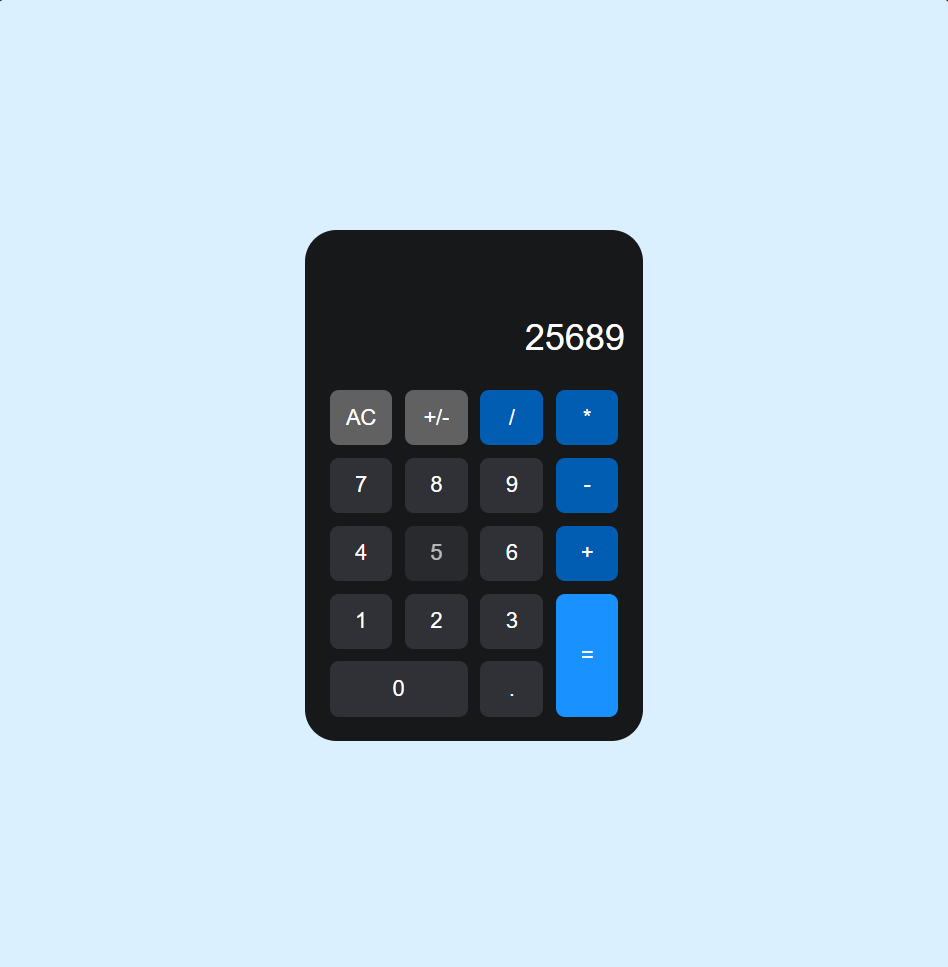
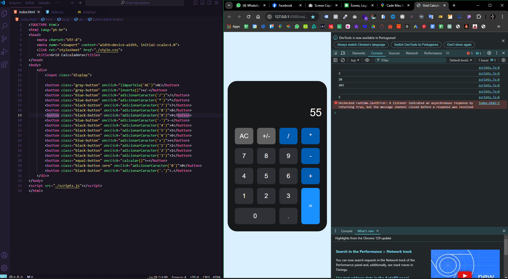

<h1 align="center"> Calculadora </h1>

Projeto Portfólio em HTML, CSS e JAVASCRIPT.  

  <a href="#-tecnologias">Tecnologias</a>&nbsp;&nbsp;&nbsp;|&nbsp;&nbsp;&nbsp;
  <a href="#-projeto">Projeto</a>&nbsp;&nbsp;&nbsp;|&nbsp;&nbsp;&nbsp;
  <a href="#-layout">Layout</a>&nbsp;&nbsp;&nbsp;|&nbsp;&nbsp;&nbsp;
  <a href="#memo-licença">Licença</a>

 

  
  

## 🚀 Tecnologias

Esse projeto foi desenvolvido com as seguintes tecnologias:

- Html
- Css
- JavaScript
- Git e Github

## 💻 Projeto

Página de um TODO List (Lista de Tarefas).

- [Acesse o projeto finalizado, online](https://schubertsantos.github.io/todolist)

## 🔖 O que foi aprendido nesse Projeto de Estudos

- Obter o valor atual exibido na tela 
- Adicionar o novo caractere ao valor atual
- Imprimir o valor atual no console (opcional)
- Limpar o conteúdo da tela
- Realizar o cálculo matemático da expressão 
- Inverter o sinal do valor atual

---

